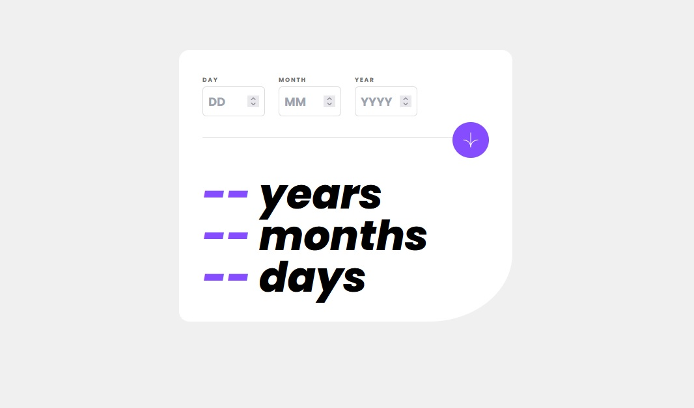
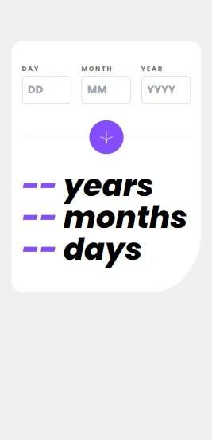

# Frontend Mentor - Age calculator app solution

This is a solution to the [Age calculator app challenge on Frontend Mentor](https://www.frontendmentor.io/challenges/age-calculator-app-dF9DFFpj-Q). Frontend Mentor challenges help you improve your coding skills by building realistic projects. 

## Table of contents

- [Overview](#overview)
  - [The challenge](#the-challenge)
  - [Screenshot](#screenshot)
  - [Links](#links)
- [My process](#my-process)
  - [Built with](#built-with)
  - [What I learned](#what-i-learned)
- [Author](#author)

## Overview

### The challenge

Users should be able to:

- View an age in years, months, and days after submitting a valid date through the form
- Receive validation errors if:
  - Any field is empty when the form is submitted
  - The day number is not between 1-31
  - The month number is not between 1-12
  - The year is in the future
  - The date is invalid e.g. 31/04/1991 (there are 30 days in April)
- View the optimal layout for the interface depending on their device's screen size
- See hover and focus states for all interactive elements on the page
- **Bonus**: See the age numbers animate to their final number when the form is submitted

### Screenshot

### Links

- Solution URL: [My solution in Frontend Mentor](https://www.frontendmentor.io/solutions/age-calculator-app-tailwind-css-1jGQHxp62W)
- Live Site URL: [See my solution running](https://age-calculator-pm9hgmvl6-nascimentolds.vercel.app/)

## My process

### Built with

- Semantic HTML5 markup
- Tailwind CSS - CDN
- Flexbox
- Mobile-first workflow
- Javascript

### What I learned

It was the first time I used Tailwind CSS. Despite being a small project I could see how intuitive and practical is using this library.

## Author

- Frontend Mentor - [@nascimentolds](https://www.frontendmentor.io/profile/nascimentolds)
- Twitter - [@marceloneander](https://twitter.com/marceloneander)

